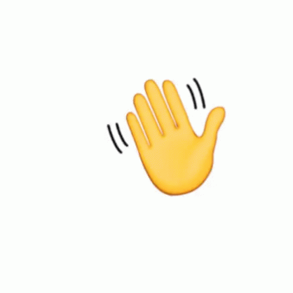

## Hi there 

I'm Tichaona Clapperton Musasa, I'm a front-end developer with a strong passion for creating intuitive, responsive user interfaces with experience in HTML, CSS, still adding JavaScript and modern frameworks such as Tailwind and Bootstrap For now I'm focusing on building seamless and engaging user experiences. I'm also eager to expand my skills into back-end development to gain a more complete understanding of full-stack applications and contribute more holistically to the development team.

## ⚙ Tools
    

## 🌐 Connect with me

## 📉 My Github Stats

 

